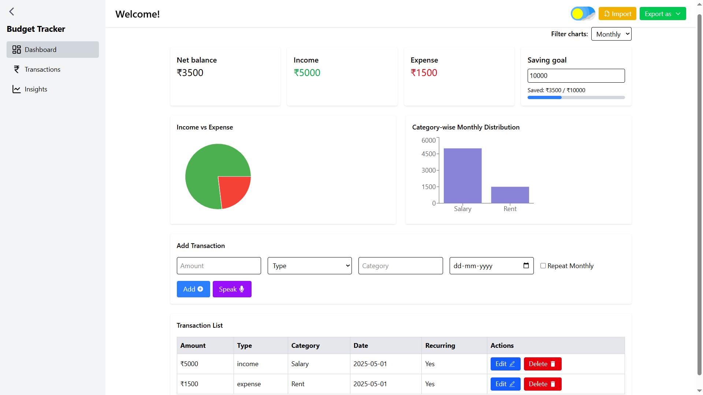

# 💸 BudgetWise - Personal Finance Tracker

**BudgetWise** is a responsive and feature-rich personal finance tracker built using **React.js**. It helps users manage their income, expenses, and gain insights into their financial habits with charts, filters, and more. 

## 🚀 Features

- 📊 **Dashboard** with real-time summary of net balance, income, and expenses
- 🧮 **Add/Edit/Delete Transactions** stored in localStorage
- 🔍 **Search & Filter** transactions by type, category, or date
- 📆 Filter data by **Weekly / Monthly / Yearly** view
- 📈 **Charts** (Pie & Bar) for better data visualization
- 📂 **Import Transactions** from excel files only
- 📂 **Export Transactions** as PDF or Excel file
- 🧠 **Insights Page** for category breakdown, monthly trends & savings rate
- 🌙 Dark Mode support

## 🧱 Tech Stack

- React.js (Hooks)
- Recharts (charts & graphs)
- Tailwind CSS (styling)
- LocalStorage (data persistence)

## 📁 Folder Structure

```
src/
├── components/
│   ├── Navbar.jsx
│   ├── Sidebar.jsx
│   └── TransactionList.jsx
├── pages/
│   ├── Dashboard.jsx
│   ├── Transactions.jsx
│   └── Insights.jsx
├── App.jsx
└── main.jsx
```

## 🔧 Setup Instructions

```bash
# 1. Clone the repository
git clone https://github.com/utkarsh3020/budgetwise.git

# 2. Navigate to the project folder
cd budgetwise

# 3. Install dependencies
npm install

# 4. Start development server
npm run dev
```

## 📌 To Do
- [ ] File-based import/export
- [ ] Authentication (optional)
- [ ] Budget Goals & Alerts
- [ ] Firebase or MongoDB integration

## 📸 Screenshots


## 📄 License
MIT License

---
**Built with 💙 by Utkarsh Gupta**
